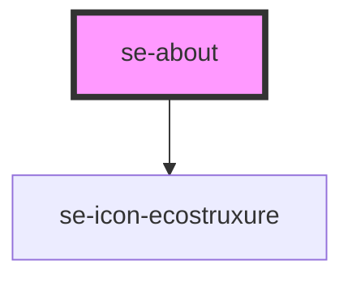

# se-about

| Slot          | Description                                                                                  |
| ------------- | -------------------------------------------------------------------------------------------- |
| `custom-info` | A space below the version number for extra information such as user, product reference, etc. |

<!-- Auto Generated Below -->

## Properties

| Property    | Attribute   | Description                                                                               | Type     | Default             |
| ----------- | ----------- | ----------------------------------------------------------------------------------------- | -------- | ------------------- |
| `appTitle`  | `app-title` | The title of your about screen.                                                           | `string` | `undefined`         |
| `copyright` | `copyright` | The copyright you would like to display.                                                  | `string` | `AppInfo.copyright` |
| `domain`    | `domain`    | The domain you want to display.  If set to `ecostruxure`, it renders an EcoStruxure icon. | `string` | `AppInfo.domain`    |
| `imageUrl`  | `image-url` | Sets the background image for your about page.                                            | `string` | `undefined`         |
| `version`   | `version`   | The version number you want to display.                                                   | `string` | `undefined`         |

## Dependencies

### Depends on

- [se-icon-ecostruxure](../icon-ecostruxure)

### Graph

----------------------------------------------

*Built with [StencilJS](https://stenciljs.com/)*
