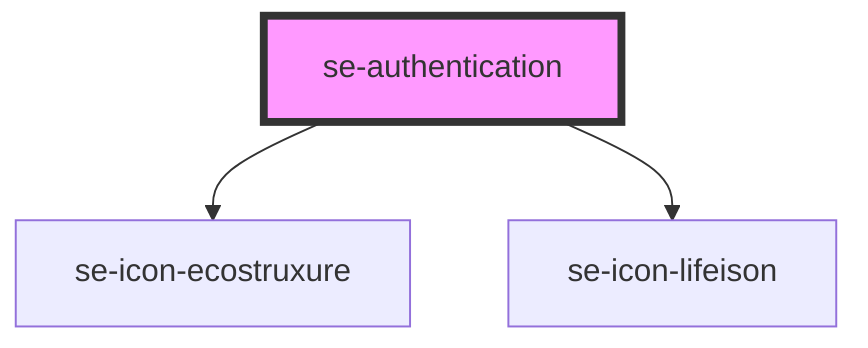

# se-authentication

<!-- Auto Generated Below -->

## Properties

| Property    | Attribute   | Description                                                                               | Type      | Default             |
| ----------- | ----------- | ----------------------------------------------------------------------------------------- | --------- | ------------------- |
| `appTitle`  | `app-title` | The title of your authentication screen.                                                  | `string`  | `undefined`         |
| `copyright` | `copyright` | The copyright you would like to display.                                                  | `string`  | `AppInfo.copyright` |
| `domain`    | `domain`    | The domain you want to display.  If set to `ecostruxure`, it renders an EcoStruxure icon. | `string`  | `AppInfo.domain`    |
| `hide`      | `hide`      | If set to `true`, this will hide the authentication screen.                               | `boolean` | `false`             |
| `imageUrl`  | `image-url` | Sets the background image for your authentication screen.                                 | `string`  | `undefined`         |
| `version`   | `version`   | The version number you want to display.                                                   | `string`  | `undefined`         |

## Dependencies

### Depends on

- [se-icon-ecostruxure](../icon-ecostruxure)
- [se-icon-lifeison](../icon-lifeison)

### Graph

----------------------------------------------

*Built with [StencilJS](https://stenciljs.com/)*
