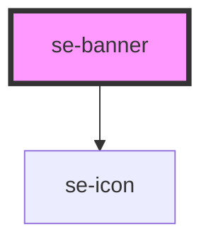

# se-banner

<!-- Auto Generated Below -->

## Properties

| Property   | Attribute  | Description                                                                                   | Type     | Default |
| ---------- | ---------- | --------------------------------------------------------------------------------------------- | -------- | ------- |
| `duration` | `duration` | Set the duration (in ms) that the banner will automatically switch slides. Default is `6000`. | `number` | `6000`  |

## Dependencies

### Depends on

- [se-icon](../icon)

### Graph

----------------------------------------------

*Built with [StencilJS](https://stenciljs.com/)*
