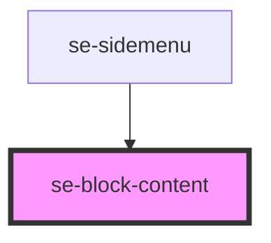

# se-block-content

<!-- Auto Generated Below -->

## Properties

| Property | Attribute | Description                                                                                                                                                                                                                              | Type                                      | Default     |
| -------- | --------- | ---------------------------------------------------------------------------------------------------------------------------------------------------------------------------------------------------------------------------------------- | ----------------------------------------- | ----------- |
| `option` | `option`  | The block-content component will add 8px padding on the top and bottom, and 16px padding on the left and right by default. When the option is set to `fill`, the content will fill the whole space of the block-content with no padding. | `"basic" \| "card" \| "fill" \| "widget"` | `undefined` |

## Dependencies

### Used by

 - [se-sidemenu](../sidemenu)

### Graph

----------------------------------------------

*Built with [StencilJS](https://stenciljs.com/)*
