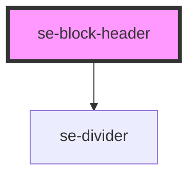

# se-block-header

| Slot  | Description                                                             |
| ----- | ----------------------------------------------------------------------- |
| `start` | Positions to the `left` of the content.                               |
| none  | Slot with no name will be positioned to the start of the element (left) |
| `end` | Positions to the `right` of the content.                                |

<!-- Auto Generated Below -->

## Properties

| Property  | Attribute | Description                                                                                                                                                                                                                                                                                      | Type                                      | Default     |
| --------- | --------- | ------------------------------------------------------------------------------------------------------------------------------------------------------------------------------------------------------------------------------------------------------------------------------------------------ | ----------------------------------------- | ----------- |
| `divider` | `divider` | Defines whether or not a divider will be applied to the se-block-header. The se-block component's divider property will be applied to the se-block-header component.                                                                                                                             | `boolean`                                 | `undefined` |
| `option`  | `option`  | Defines the visual appearance of a header. Updated automatically by the `se-block` component when the option is set to `card`, which will update the design of the header with respect to the card design. `fill` removes all spacing, for example with use of the `se-tabbar` option `content`. | `"basic" \| "card" \| "fill" \| "widget"` | `undefined` |

## Dependencies

### Depends on

- [se-divider](../divider)

### Graph

----------------------------------------------

*Built with [StencilJS](https://stenciljs.com/)*
