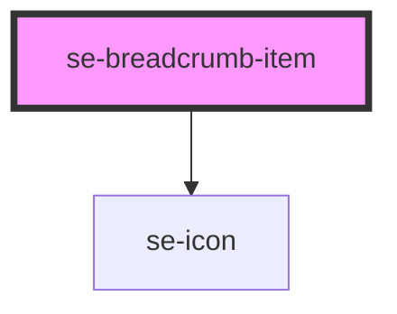

# se-breadcrumb-item

<!-- Auto Generated Below -->

## Properties

| Property | Attribute | Description                                                                                       | Type      | Default     |
| -------- | --------- | ------------------------------------------------------------------------------------------------- | --------- | ----------- |
| `href`   | `href`    | Indicates the URL you wish to navigate to when clicking on your breadcrumb item.                  | `string`  | `undefined` |
| `isLast` | `is-last` | Indicates whether or not the breadcrumb item should be selected.  The default setting is `false`. | `boolean` | `false`     |

## Dependencies

### Depends on

- [se-icon](../icon)

### Graph

----------------------------------------------

*Built with [StencilJS](https://stenciljs.com/)*
