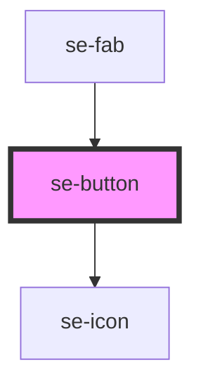

# se-button

| Slot   | Description                                                                                       |
| ------ | ------------------------------------------------------------------------------------------------- |
| `icon` | Another way to configure your own icon instead of using the icon property (used to load svg icon) |
| none   | The text of the button                                                                            |

<!-- Auto Generated Below -->

## Properties

| Property    | Attribute    | Description                                                                                                                                                                                                                                                                                                               | Type                                                                                        | Default      |
| ----------- | ------------ | ------------------------------------------------------------------------------------------------------------------------------------------------------------------------------------------------------------------------------------------------------------------------------------------------------------------------- | ------------------------------------------------------------------------------------------- | ------------ |
| `block`     | `block`      | Optional property that defines if the button displays as a block in it's container. When set to true, the button will be as wide as its container.                                                                                                                                                                        | `boolean`                                                                                   | `undefined`  |
| `caption`   | `caption`    | Optional property that defines if the button has a caption or tooltip text.                                                                                                                                                                                                                                               | `string`                                                                                    | `undefined`  |
| `color`     | `color`      | Defines the background color of the button. The default setting is `standard`.                                                                                                                                                                                                                                            | `"alternative" \| "primary" \| "secondary" \| "standard"`                                   | `'standard'` |
| `disabled`  | `disabled`   | Optional property that defines if the button is disabled.  Set to `false` by default.                                                                                                                                                                                                                                     | `boolean`                                                                                   | `false`      |
| `icon`      | `icon`       | Optional property that determines if your button includes an icon.                                                                                                                                                                                                                                                        | `string`                                                                                    | `undefined`  |
| `iconColor` | `icon-color` | Optional property to change the color of the icon when needed. For example, the user dropdown in the header component.                                                                                                                                                                                                    | `"alternative" \| "primary" \| "secondary" \| "standard"`                                   | `undefined`  |
| `iconOnly`  | `icon-only`  | Property to specify if the button should only display an icon (no extra spacing).                                                                                                                                                                                                                                         | `boolean`                                                                                   | `false`      |
| `option`    | `option`     | Defines the visual appearance of the button. `flat` is the default option, which includes a gray background. `raised` adds a box shadow to the button. `outline` adds a border to the button. `login` and `signup` are specific options for "Login" and "Sign Up" buttons in your application.                            | `"fab" \| "flat" \| "inherit" \| "login" \| "minifab" \| "outline" \| "raised" \| "signup"` | `'flat'`     |
| `selected`  | `selected`   | Optional property that defines if the button should be shown as selected. Used with the `se-radio-group` component.                                                                                                                                                                                                       | `boolean`                                                                                   | `undefined`  |
| `size`      | `size`       | Defines the size of the button. `nano` sets the font to 12px font and a 24px height.  Used primarily with the `se-radio-group` component. `small` is the default option, with a 14px font and a 32px height. `medium` sets the font to 16px and the height to 40px. `large` sets the font to 18px and the height to 48px. | `"large" \| "medium" \| "nano" \| "small"`                                                  | `'small'`    |
| `type`      | `type`       | Optional property. `button`	is the default setting, creating a clickable button. `submit`	creates a "submit" button (useful to submit form-data). `reset`	creates a reset button (useful to reset form-data to its initial values).                                                                                       | `"button" \| "reset" \| "submit"`                                                           | `'button'`   |
| `value`     | `value`      | Optional property that defines the value of your button, which gets passed to the parent component when clicking the button.                                                                                                                                                                                              | `string`                                                                                    | `undefined`  |

## Events

| Event      | Description                                            | Type               |
| ---------- | ------------------------------------------------------ | ------------------ |
| `didClick` | Passes button data to the parent component on a click. | `CustomEvent<any>` |

## Methods

### `setDisabled(val: boolean) => Promise<void>`

Sets the disabled property for your button from the parent component.

#### Returns

Type: `Promise<void>`

### `setGrouped() => Promise<void>`

Indicates if the button is part of a group of buttons within the `se-radio-group` component.

#### Returns

Type: `Promise<void>`

## Dependencies

### Used by

 - [se-fab](../fab)

### Depends on

- [se-icon](../icon)

### Graph

----------------------------------------------

*Built with [StencilJS](https://stenciljs.com/)*
