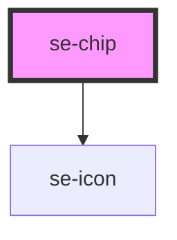

# se-chip

<!-- Auto Generated Below -->

## Properties

| Property   | Attribute   | Description                                                                                                                                           | Type                          | Default      |
| ---------- | ----------- | ----------------------------------------------------------------------------------------------------------------------------------------------------- | ----------------------------- | ------------ |
| `block`    | `block`     | Optional property that defines if the chip displays as a block in it's container. When set to true, the chip will be as wide as its container.        | `boolean`                     | `undefined`  |
| `canClose` | `can-close` | Indicates whether or not the chip has a close button.  Set to `false` by default.                                                                     | `boolean`                     | `false`      |
| `color`    | `color`     | Defines the background color of the chip.  The default setting is `standard`, which is a light gray color.                                            | `"alternative" \| "standard"` | `'standard'` |
| `disabled` | `disabled`  | Indicates whether or not the chip is disabled.  Set to `false` by default.                                                                            | `boolean`                     | `false`      |
| `selected` | `selected`  | Indicates whether or not the chip is selected.  Set to `false` by default.                                                                            | `boolean`                     | `false`      |
| `size`     | `size`      | Defines the size of the chip. `nano` sets the font to 14px and the height to 24px. `small` is the default option, with a 16px font and a 32px height. | `"nano" \| "small"`           | `'small'`    |
| `value`    | `value`     | The text you want to display in your chip.                                                                                                            | `string`                      | `undefined`  |

## Events

| Event      | Description                                                                           | Type               |
| ---------- | ------------------------------------------------------------------------------------- | ------------------ |
| `didClose` | Send the chip value to the parent component when clicking the close button of a chip. | `CustomEvent<any>` |

## Dependencies

### Depends on

- [se-icon](../icon)

### Graph

----------------------------------------------

*Built with [StencilJS](https://stenciljs.com/)*
