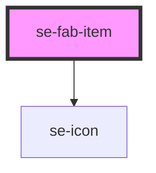

# se-fab-item

| Slot   | Description                                                                                       |
| ------ | ------------------------------------------------------------------------------------------------- |
| `icon` | Another way to configure your own icon instead of using the icon property (used to load svg icon) |
| none   | The text label for your fab-item                                                                  |

<!-- Auto Generated Below -->

## Properties

| Property | Attribute | Description                                                                    | Type     | Default     |
| -------- | --------- | ------------------------------------------------------------------------------ | -------- | ----------- |
| `icon`   | `icon`    | Property that determines if an icon is included in the floating action button. | `string` | `undefined` |

## Events

| Event      | Description                                                            | Type               |
| ---------- | ---------------------------------------------------------------------- | ------------------ |
| `didClick` | Send the value of the caption to the parent when clicking on the item. | `CustomEvent<any>` |

## Dependencies

### Depends on

- [se-icon](../icon)

### Graph

----------------------------------------------

*Built with [StencilJS](https://stenciljs.com/)*
