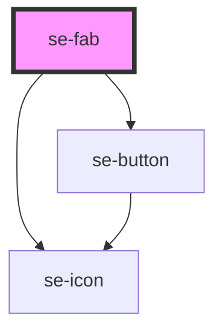

# se-fab

<!-- Auto Generated Below -->

## Properties

| Property   | Attribute  | Description                                                                                                                                                                                                                                                    | Type                         | Default       |
| ---------- | ---------- | -------------------------------------------------------------------------------------------------------------------------------------------------------------------------------------------------------------------------------------------------------------- | ---------------------------- | ------------- |
| `color`    | `color`    | Indicates the color of your main action button . The Default setting is `primary`, rendering a green background. The `alternative` setting renders a white background.                                                                                         | `"alternative" \| "primary"` | `'primary'`   |
| `icon`     | `icon`     | Property that determines if an icon is included in the main action button.                                                                                                                                                                                     | `string`                     | `undefined`   |
| `option`   | `option`   | Property that determines the functionality of the FAB. The default setting is `speeddial`, which will show/hide a dropdown menu when clicking on the FAB. The `backtotop` setting returns you to the top of the page you are viewing when clicking on the FAB. | `"backtotop" \| "speeddial"` | `'speeddial'` |
| `position` | `position` | Property that determines the position of the component. The default setting is `bottom`, rendering a FAB at the bottom right corner. The `top` setting renders the FAB at the top right corner.                                                                | `"bottom" \| "top"`          | `'bottom'`    |

## Methods

### `toggleAction() => Promise<void>`

Use this method to toggle (show/hide) the mini action buttons.

#### Returns

Type: `Promise<void>`

## Dependencies

### Depends on

- [se-button](../button)
- [se-icon](../icon)

### Graph

----------------------------------------------

*Built with [StencilJS](https://stenciljs.com/)*
