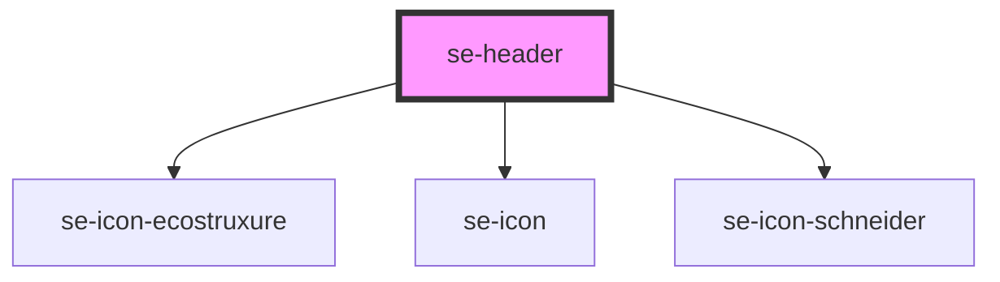

# se-header

| Slot    | Description                                                                                   |
| ------- | --------------------------------------------------------------------------------------------- |
| `start` | Positions to the `left` of the content (immediately to the right of the domain and project title). Can be used to place a project dropdown if necessary.  |
| none    | Positions the content in the middle of the header (centered)                                   |
| `end`   | Positions to the `right` of the content. Can be used for the user dropdown, external links... |

<!-- Auto Generated Below -->

## Properties

| Property   | Attribute   | Description                                                                                                                                     | Type     | Default          |
| ---------- | ----------- | ----------------------------------------------------------------------------------------------------------------------------------------------- | -------- | ---------------- |
| `appTitle` | `app-title` | Sets the title of your application.                                                                                                             | `string` | `""`             |
| `domain`   | `domain`    | Defines the domain of the application. By default, the domain is `ecostruxure`. If `none`, then no domain will be displayed.                    | `string` | `AppInfo.domain` |
| `project`  | `project`   | Defines the project name (useful for small projects) that can be used for versioning as well. It will be placed at the right side of the title. | `string` | `undefined`      |

## Dependencies

### Depends on

- [se-icon-ecostruxure](../icon-ecostruxure)
- [se-icon](../icon)
- [se-icon-schneider](../icon-schneider)

### Graph

----------------------------------------------

*Built with [StencilJS](https://stenciljs.com/)*
