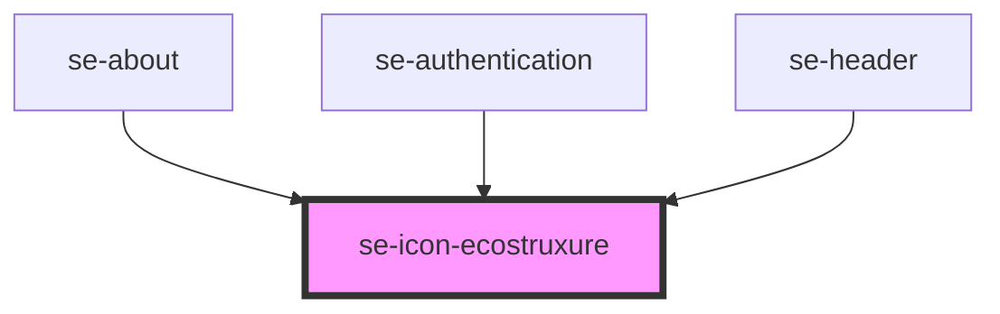

# se-icon-ecostruxure

<!-- Auto Generated Below -->

## Properties

| Property | Attribute | Description                                                                                                                                                               | Type                        | Default      |
| -------- | --------- | ------------------------------------------------------------------------------------------------------------------------------------------------------------------------- | --------------------------- | ------------ |
| `color`  | `color`   | Defines the color of the logo. `standard`: displays a light green / dark green conventional SE logo. `inherited`: default option, which takes the color from it's parent. | `"inherited" \| "standard"` | `"standard"` |
| `size`   | `size`    | Sets the size of the EcoStruxure icon.  The default setting is `small`.                                                                                                   | `"medium" \| "small"`       | `"small"`    |

## Dependencies

### Used by

 - [se-about](../about)
 - [se-authentication](../authentication)
 - [se-header](../header)

### Graph

----------------------------------------------

*Built with [StencilJS](https://stenciljs.com/)*
