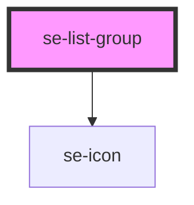

# se-list-group

| Slot   | Description                                                                                       |
| ------ | ------------------------------------------------------------------------------------------------- |
| `icon` | Another way to configure your own icon instead of using the icon property (used to load svg icon) |

<!-- Auto Generated Below -->

## Properties

| Property        | Attribute        | Description                                                                                                                        | Type                                                           | Default     |
| --------------- | ---------------- | ---------------------------------------------------------------------------------------------------------------------------------- | -------------------------------------------------------------- | ----------- |
| `canCollapse`   | `can-collapse`   | Defines if list groups can be collapsed, true by default.                                                                          | `boolean`                                                      | `true`      |
| `collapsed`     | `collapsed`      | Defines if the item group is collapsed/closed. The default setting is `false`.                                                     | `boolean`                                                      | `false`     |
| `description`   | `description`    | Defines the description of the item, placed under its title.                                                                       | `string`                                                       | `undefined` |
| `icon`          | `icon`           | Places an icon on the left side of the item list.                                                                                  | `string`                                                       | `undefined` |
| `iconColor`     | `icon-color`     | Optional property to define the color of the icon. The default color will be inherited from it's parent.                           | `"primary" \| "secondary"`                                     | `undefined` |
| `indentation`   | `indentation`    | Defines the group indentation to add paddings to the list item (used with multiple list groups).                                   | `number`                                                       | `0`         |
| `item`          | `item`           | Defines the title of the item.                                                                                                     | `string`                                                       | `undefined` |
| `option`        | `option`         | Defines the style of the list. The default setting is `classic`, and the style will be handled and modified by the parent element. | `"classic" \| "dropdown" \| "headline" \| "nav" \| "treeview"` | `undefined` |
| `selected`      | `selected`       | Defines if the list group should be displayed as selected (if one of its child elements is selected when collapsed).               | `boolean`                                                      | `undefined` |
| `selectedChild` | `selected-child` |                                                                                                                                    | `boolean`                                                      | `undefined` |

## Events

| Event              | Description                                           | Type               |
| ------------------ | ----------------------------------------------------- | ------------------ |
| `didGroupClick`    | Emitted when the group item is clicked.               | `CustomEvent<any>` |
| `didGroupCollapse` | Emitted when the group item is collapsed/uncollapsed. | `CustomEvent<any>` |

## Dependencies

### Depends on

- [se-icon](../icon)

### Graph

----------------------------------------------

*Built with [StencilJS](https://stenciljs.com/)*
