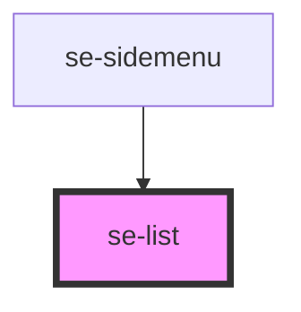

# se-list

<!-- Auto Generated Below -->

## Properties

| Property      | Attribute      | Description                                                              | Type                                                           | Default     |
| ------------- | -------------- | ------------------------------------------------------------------------ | -------------------------------------------------------------- | ----------- |
| `canCollapse` | `can-collapse` | Defines if list groups can be collapsed.  The default setting is `true`. | `boolean`                                                      | `true`      |
| `option`      | `option`       | Defines the style of the list.  The default setting is `classic`.        | `"classic" \| "dropdown" \| "headline" \| "nav" \| "treeview"` | `"classic"` |

## Dependencies

### Used by

 - [se-sidemenu](../sidemenu)

### Graph

----------------------------------------------

*Built with [StencilJS](https://stenciljs.com/)*
