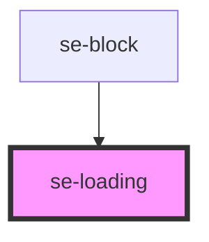

# se-loading

<!-- Auto Generated Below -->

## Properties

| Property  | Attribute | Description                                                                                                                                                                                             | Type                     | Default      |
| --------- | --------- | ------------------------------------------------------------------------------------------------------------------------------------------------------------------------------------------------------- | ------------------------ | ------------ |
| `loading` | `loading` | Displays the loading icon on screen when set to `true`.                                                                                                                                                 | `boolean`                | `undefined`  |
| `option`  | `option`  | Defines the visual display of the loader. `standard` is the default option, and displays a spinning green circle. `dialog` gives the loading icon a look-and-feel that it is within a popup dialog box. | `"dialog" \| "standard"` | `'standard'` |

## Dependencies

### Used by

 - [se-block](../block)

### Graph

----------------------------------------------

*Built with [StencilJS](https://stenciljs.com/)*
