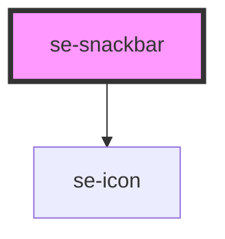

# se-snackbar

| Slot   | Description                                                                                       |
| ------ | ------------------------------------------------------------------------------------------------- |
| `icon` | Another way to configure your own icon instead of using the icon property (used to load svg icon) |
| none   | Can be used to contain the snackbar message instead of the `message` parameter                    |

<!-- Auto Generated Below -->

## Properties

| Property     | Attribute     | Description                                                                                                                                                        | Type                                                 | Default                |
| ------------ | ------------- | ------------------------------------------------------------------------------------------------------------------------------------------------------------------ | ---------------------------------------------------- | ---------------------- |
| `actionText` | `action-text` | Defines the text you want your custom action button to read.                                                                                                       | `string`                                             | `undefined`            |
| `canClose`   | `can-close`   | Displays a "button" to close the snackbar. The default setting is `false`. This will be visible if set to `true`.                                                  | `boolean`                                            | `false`                |
| `duration`   | `duration`    | Indicates the duration (in milliseconds) that the snackbar will display on screen before auto-closing, if `canClose` is set to false. The default setting is 5000. | `number`                                             | `5000`                 |
| `icon`       | `icon`        | The name of the icon you wish to display.  The default icon is an information circle.                                                                              | `string`                                             | `'information_circle'` |
| `message`    | `message`     | The content of the message you want the snackbar to display.                                                                                                       | `string`                                             | `undefined`            |
| `open`       | `open`        | Indicates if the snackbar is open.  Set to `false` (closed) by default.                                                                                            | `boolean`                                            | `false`                |
| `type`       | `type`        | Indicates the background color of your snackbar. `success`: green `warning`: orange `error`: red `information`: dark grey, default setting                         | `"error" \| "information" \| "success" \| "warning"` | `'information'`        |

## Events

| Event           | Description                                                                     | Type               |
| --------------- | ------------------------------------------------------------------------------- | ------------------ |
| `actionClicked` | Sends information to the parent component when clicking a custom action button. | `CustomEvent<any>` |
| `didClose`      | Sends information to the parent component when closing the snackbar.            | `CustomEvent<any>` |

## Dependencies

### Depends on

- [se-icon](../icon)

### Graph

----------------------------------------------

*Built with [StencilJS](https://stenciljs.com/)*
