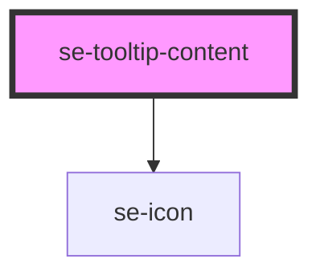

# se-tooltip-content

| Slot   | Description                                                                                       |
| ------ | ------------------------------------------------------------------------------------------------- |
| `icon` | Another way to configure your own icon instead of using the icon property (used to load svg icon) |

<!-- Auto Generated Below -->

## Properties

| Property | Attribute | Description                                            | Type     | Default     |
| -------- | --------- | ------------------------------------------------------ | -------- | ----------- |
| `icon`   | `icon`    | Indicates an icon you want to display in your tooltip. | `string` | `undefined` |

## Dependencies

### Depends on

- [se-icon](../icon)

### Graph

----------------------------------------------

*Built with [StencilJS](https://stenciljs.com/)*
